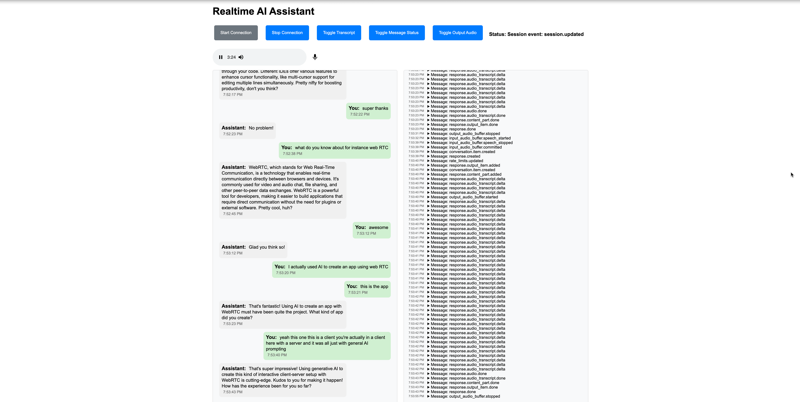

# OpenAI Realtime API Client


[](https://openai.com)

# Realtime AI Assistant with WebRTC

A realtime voice assistant leveraging WebRTC for low-latency communication with OpenAI's realtime API. The system features:

- 🔁 Bidirectional audio streaming using WebRTC media channels
- 💬 Real-time transcript display with chat-style bubbles
- 🔐 Ephemeral key authentication for secure sessions
- 🎚️ Interactive UI controls for audio/video management

**AI-Assisted Development**  
This entire repository was generated through iterative prompting workflows using [Cursor](https://cursor.sh/) with OpenAI's o3-mini model in an initial 4-hour session (including this README.md!). The implementation demonstrates practical application of AI pair-programming for complex real-time systems development. See [AI-Assisted Development Flow](/realtime_client/docs/Prompting_history.png), where the green-outlined prompts indicate the refactoring from WebSockets to WebRTC for the current browser implementation.

A multi-modal client implementation for OpenAI's Realtime API with voice/text interactions via WebRTC and WebSockets.


## Features

**Core Capabilities**

- 🎙️ Real-time voice conversations with GPT-4o models
- 📡 Dual protocol support (WebRTC & WebSockets)
- ⚡ Low-latency audio processing (16-bit PCM)
- 🔄 Bi-directional event handling
- 🔒 Ephemeral key rotation
- 🎯 Voice Activity Detection (VAD) with configurable thresholds
- 🔄 Session lifecycle management (create/update/terminate)

**Modality Support**

- Real-time audio transcriptions
- Text generation with delta updates
- Concurrent multi-modal interactions
- Custom conversation context management
- Speech recognition integration
- Function calling support
- Audio input/output device management

## Appview



## Installation

### Prerequisites

- Python 3.11+
- [Poetry](https://python-poetry.org/docs/#installation)
- OpenAI API key
- PortAudio development files (Ubuntu/Debian: `sudo apt install portaudio19-dev python3-dev`)

```bash
# Clone repository
git https://github.com/dswinscoe/realtimeAI.git
cd realtimeAI/realtime-client

# Install project dependencies
poetry install

# Configure environment
cp .env.example .env
nano .env  # Add your OpenAI API key

```

## Usage

```bash
# Start FastAPI server (development mode)
poetry run uvicorn app.server:app --reload --port 9090

# Run Python client
poetry run python app/client.py

# Access web client at: http://localhost:9090

# VS Code Launch Realtime Server
# For VS Code / Cursor users, a launch configuration is included. Simply open the project in VS Code, go to the Debug view, and select the 'Launch Realtime Server' configuration to start the server effortlessly.
```

## Architecture

| Component           | Description                                   |
| ------------------- | --------------------------------------------- |
| `/app/server.py`    | FastAPI endpoint for ephemeral keys           |
| `/app/client.py`    | Python WebRTC implementation                  |
| `/static/client.js` | Browser WebRTC client with speech recognition |
| `pyproject.toml`    | Dependency configuration                      |

## Development

```bash
# Run tests
poetry run pytest

# Format code
poetry run black .

# Lint checks
poetry run flake8
```

## Documentation

- [Overview](/realtime_client/docs/realtime_overview.md)
- [WebRTC Connection Guide](/realtime_client/docs/realtime_connect_with_WebRTC.md)
- [Model Capabilities](/realtime_client/docs/realtime_model_capabilities.md)
- [WebSocket Implementation](/realtime_client/docs/realtime_connect_with_Websockets.md)
- [AI Development Process](/realtime_client/docs/ai_development_process.md)

**Note:** The `/realtime_client/docs` directory contains unmodified markdown files from OpenAI's public documentation, which were used as a context for the project's GenAI-assisted implementation. These docs provided essential insights into the API's capabilities, and were the foundation for the above AI-assisted development workflow with Cursor and the o3-mini model.

## License

MIT Licensed. See [LICENSE](LICENSE) for details.

## Cost Considerations ⚠️

**Important Usage Warning**  
OpenAI's Realtime API has a complex pricing structure that combines text and audio token costs. Developers should carefully monitor usage due to potentially high expenses:

**Pricing Overview (GPT-4o)**

- 🎙️ Audio Input: $100/million tokens (~$0.06/min)
- 🔊 Audio Output: $200/million tokens (~$0.24/min)
- 📝 Text Input: $5/million tokens
- 📄 Text Output: $20/million tokens

**Real-World Cost Examples**

- 5-minute voice conversation ≈ $5.38
- 10-minute conversation ≈ $10
- Heavy testing can exceed $200/day

**Development Recommendations**

1. Implement strict usage monitoring
2. Set budget alerts in OpenAI dashboard
3. Use test mode for initial development
4. Consider cost/performance tradeoffs carefully

> "Pricing would need to decrease 10x for viable commercial implementation" - Developer Community Feedback

**References**  
[OpenAI Community Discussion](https://community.openai.com/t/realtime-api-extremely-expensive/966825) ·
[Cost Analysis Article](https://seasalt.ai/blog/openai-chatgpt-realtime-api-cost-breakdown) ·
[ZDNet Coverage](https://www.zdnet.com/article/openai-lets-developers-build-real-time-voice-apps-at-a-substantial-premium/)
